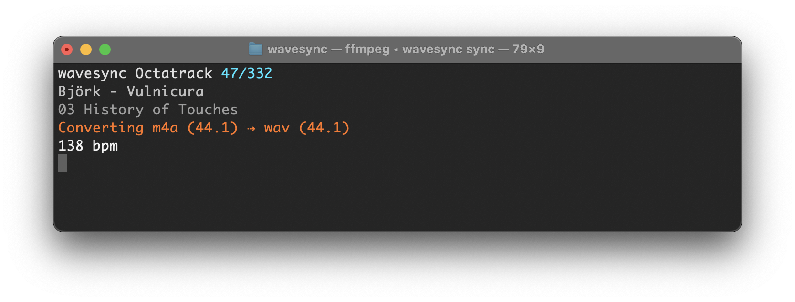

# Wavesync

Wavesync is a Ruby-based CLI tool that scans your music library and automatically converts audio files to match the specifications of the [teenage engineering TP-7](https://teenage.engineering/products/tp-7), the [Elektron Octatrack MKII](https://www.elektron.se/explore/octatrack-mkii), and the [Playdate](https://kicooya.com/), adjusting sample rate, bit depth and file format as needed while preserving your original library structure and only converting files that don't already meet the device requirements.

It can also analyse the BPM of the tracks in your library and store the information as metadata in your files, as well as convert the metadata so that the target device can read the BPM. When syncing to the Octatrack, you can choose to add padding to each track, so that it's dead-simple to auto-slice your tracks to a multiple of full bars which allows precise looping, and seamlessly jumping to different parts of a track with Octatrack's sequencer.



## Supported file types

Wavesync supports the following file types in your source library:

- M4A
- MP3
- WAV
- AIF

Unsupported file types will be ignored when syncing.

## Installation

1. Install Ruby

   https://www.ruby-lang.org/en/documentation/installation/

2. Install dependencies

```bash
brew install ffmpeg
brew install libmtp
brew install python@3.11
python3.11 -m venv ~/.wavesync-venv
~/.wavesync-venv/bin/pip install essentia
```

3. Install Wavesync

```bash
gem install wavesync --pre
```

## Configuration

Wavesync is configured via a YAML file. By default it looks for `~/wavesync.yml`. You can also pass a path explicitly with the `-c` flag.

### wavesync.yml format

```yaml
library: ~/Music/Library
devices:
  - name: TP-7
    model: TP-7
    transport: mtp
    path: library
  - name: Octatrack
    model: Octatrack
    path: /Volumes/OCTATRACK/LIBRARY/AUDIO
  - name: Playdate
    model: Playdate
    path: /Volumes/PLAYDATE/Data/com.abenokobo.kicooya/media/music
```

- `library`: path to your source music library
- `devices`: list of devices to sync to, each with:
  - `name`: a label for this device, used with the `-d` command-line option
  - `model`: device model (`TP-7`, `Octatrack`, or `Playdate`)
  - `path`: where to write files on the device
    - For `transport: filesystem` (default): a path on your local filesystem (e.g. a mounted USB volume).
    - For `transport: mtp`: a folder path inside the device (e.g. `library` for the TP-7).
  - `transport` (optional): `filesystem` (default) or `mtp`. Use `mtp` for the TP-7.
  - `mp3_bitrate` (optional): bitrate in kbps to use when encoding MP3 files for this device. Accepted values: `96`, `128`, `160`, `192`, `256`, `320`. Defaults to `192`. Source files that are already MP3 are copied as-is regardless of this setting.

When syncing over MTP, wavesync caches converted files in `~/.cache/wavesync/<device-name>/` so subsequent syncs only push files that aren't already on the device.

## Usage

### Help

```bash
# List all available commands
wavesync help
```

### Analyze

```bash
# Analyze library files for BPM and write results to file metadata
# Files that already have BPM set are skipped
wavesync analyze

# Overwrite existing BPM values
wavesync analyze -f
```

### Sync

```bash
# Sync library
# If multiple devices are configured, you will be prompted to select one
wavesync sync

# Sync to a specific device (by name as defined in config)
wavesync sync -d Octatrack

# Pad each track with silence so its total length aligns to a multiple of 64 bars
# (Octatrack only — requires BPM metadata on each track)
wavesync sync -p
```

When a source file's sample rate isn't supported by the target device, Wavesync selects the closest supported rate. Example: If a 96kHz file is synced to an Octatrack (which only supports 44.1kHz), it will be downsampled to 44.1kHz.

Before syncing the TP-7:

- Quit field kit and any other app that may claim the TP-7. They cannot run at the same time as wavesync — only one process can hold the MTP session.
- Put the TP-7 into MTP mode: hold down the Stop button while turning the TP-7 on, and keep holding until MTP mode is engaged.

### Pull

```bash
# Read cue points from the device's WAV files and write them back into the
# matching source files in your library. Useful when you've added or edited
# cue points on the device and want them reflected in the source library.
# If multiple devices are configured, you will be prompted to select one.
wavesync pull

# Pull from a specific device (by name as defined in config)
wavesync pull -d TP-7
```

Only WAV source files with matching WAV target files on the device are updated. If the source already has the same cue points as the device, it is left untouched.

### Setlists (experimental)

A setlist is a named, ordered selection of tracks from your library. Setlists are stored as YAML files inside a `.setlists` folder within the library directory. Syncing setlists to devices is not yet implemented.

```bash
# Create a new setlist and open the interactive editor
wavesync setlist create NAME

# Edit an existing setlist
wavesync setlist edit NAME

# List all setlists
wavesync setlist list
```

## Development

### Running Tests, RuboCop, and Type Checks

```bash
rake
```

This runs RuboCop (with auto-fix), Steep type checks, and the test suite in sequence.

### Running Integration Tests

Integration tests sync against real connected devices and are not run as part of the default `rake` task.

```bash
rake test:integration
```

### Regenerating Test Fixtures

Test fixtures are pre-generated audio files committed to the repository. To regenerate them:

```bash
rake fixtures:generate
```

### Releasing

```bash
rake release:publish
```

This tags the current version, pushes the tag to origin, builds the gem, and publishes it to RubyGems.
